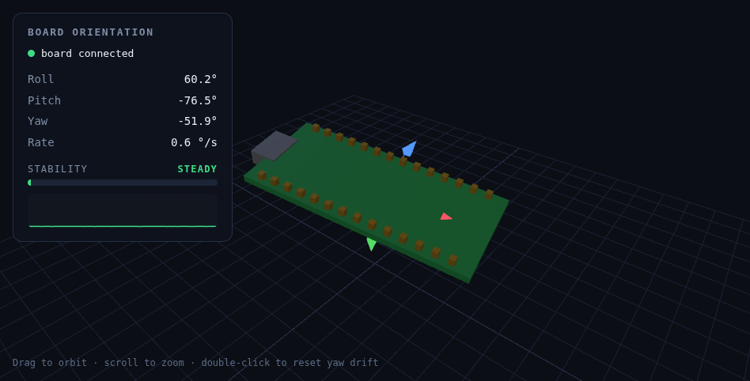

# Board Orientation

Real-time 3D orientation tracking for an **Arduino Nano 33 BLE**, visualized live in the
browser. The board's on-board IMU is fused into an orientation quaternion and a little 3D
model of the board mirrors its real attitude — tilt the board, the model tilts with it.



The panel shows live **roll / pitch / yaw**, the current angular **rate**, and a
**stability** indicator (STEADY / MOVING / FAST) with a rolling sparkline — handy for
seeing how steadily the board is being held.

## How it works

```
LSM9DS1 / BMI270 IMU  ──>  Madgwick fusion (on-board)  ──>  USB serial (quaternion + rate)
                                                                    │
                                              bridge.py (serial → WebSocket + static files)
                                                                    │
                                              browser: Three.js 3D model + HUD (web/)
```

1. **`sketch/OrientationStream`** reads the accelerometer + gyroscope and runs a
   [Madgwick](https://x-io.co.uk/open-source-imu-and-ahrs-algorithms/) sensor-fusion
   filter *on the board*, streaming a unit quaternion `q0,q1,q2,q3` plus the gyro
   magnitude (a stability metric) over USB at ~50 Hz.
2. **`bridge.py`** reads that serial stream, serves the web page, and forwards each
   sample to the browser over a WebSocket.
3. **`web/`** renders a 3D board model with Three.js and applies the quaternion every
   frame, plus the orientation/stability HUD.

## What it can (and can't) do

- ✅ **Orientation** (which way the board is tilted / pointing) — precise and stable.
- ✅ **Motion / stability** (how much it's rotating right now).
- ❌ **Absolute XYZ position** — *not possible* from an IMU alone; integrating
  acceleration drifts to nonsense within seconds. Position needs external reference
  hardware (camera, UWB, etc.).

> 6-axis fusion (gyro + accel) is used by default: roll & pitch are absolute and rock
> solid; yaw is relative and may drift slowly. Double-click the view to zero out yaw
> drift. The magnetometer (present on both IMU variants) can be added for an absolute
> compass heading once hard/soft-iron calibration is in place.
>
> **Gyro bias calibration:** on reset the sketch averages the gyro for ~2 s to measure
> its zero-rate offset, so **keep the board still for the first couple of seconds after
> flashing/reset**. Without this the raw ~0.5 °/s gyro bias integrates into runaway yaw
> drift; with it the residual is ~0.1 °/s (the sensor noise floor).

## Quick start

```bash
# 1. Flash the board (needs arduino-cli + the mbed_nano core)
arduino-cli core install arduino:mbed_nano
arduino-cli lib install Arduino_BMI270_BMM150   # or Arduino_LSM9DS1 — see note below
arduino-cli compile --fqbn arduino:mbed_nano:nano33ble sketch/OrientationStream
arduino-cli upload  --fqbn arduino:mbed_nano:nano33ble -p /dev/ttyACM0 sketch/OrientationStream

# 2. Run the bridge (Python 3 + pyserial + websockets)
python3 bridge.py            # auto-detects the Arduino port

# 3. Open the visualization
#    http://localhost:8000   in Chrome
```

### Which IMU library?

The Nano 33 BLE comes in two flavors with **different IMU chips** but the *same* USB name:

| Board | IMU | Library | I2C addresses |
|-------|-----|---------|---------------|
| Nano 33 BLE (rev1) / Sense | LSM9DS1 | `Arduino_LSM9DS1` | `0x6B`, `0x1E` |
| Nano 33 BLE Rev2 / Sense Rev2 | BMI270 + BMM150 | `Arduino_BMI270_BMM150` | `0x68`, `0x10` |

Both expose the identical `IMU.*` API, so only the `#include` differs. If `IMU.begin()`
fails, you have the other variant — flash `sketch/I2CScan` to see which addresses respond
and switch the include accordingly. (This repo's sketch is set up for the **Rev2 / BMI270**.)

## Repo layout

```
sketch/OrientationStream/   Arduino sketch: IMU + on-board Madgwick fusion, streams quaternion
sketch/I2CScan/             Utility: identify which IMU chip is fitted
bridge.py                   Serial → WebSocket bridge + static file server
web/                        Three.js 3D visualization (index.html, app.js, three.module.min.js)
```

## Requirements

- Arduino Nano 33 BLE (either IMU variant)
- [`arduino-cli`](https://arduino.github.io/arduino-cli/) with the `arduino:mbed_nano` core
- Python 3 with `pyserial` and `websockets`
- A Chromium-based browser
